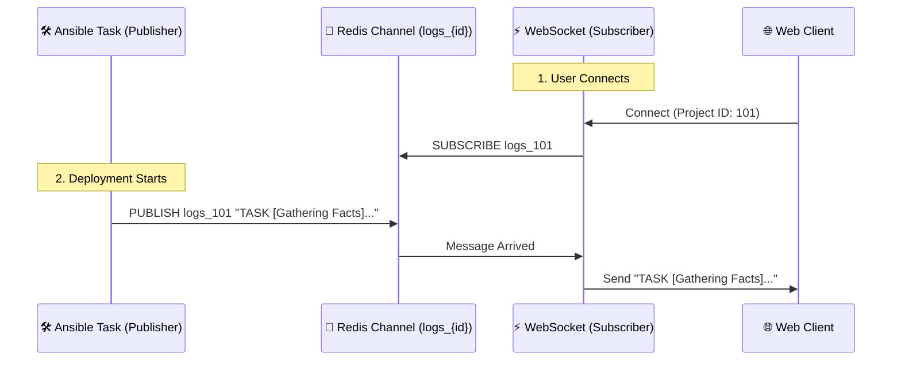

# 📡 Redis Role & Execution Logic (`new_cmp/main.py`)

## 1. 🎯 Role of Redis
이 프로젝트에서 Redis는 **실시간 로그 스트리밍을 위한 메시지 브로커(Message Broker)** 역할을 수행합니다.

*   **비동기 통신**: Ansible이 실행되는 백그라운드 프로세스와, 웹 브라우저와 연결된 WebSocket 프로세스 간의 통신을 담당합니다.
*   **Pub/Sub 패턴**: 발행(Publish)과 구독(Subscribe) 모델을 사용하여, Ansible 로그가 발생할 때마다 해당 프로젝트를 보고 있는 모든 클라이언트에게 즉시 전송합니다.

---

## 2. 🔄 Execution Logic (Pub/Sub Flow)

### 2.1. 전체 흐름도



### 2.2. 상세 로직 분석

#### A. 구독자 (Subscriber) - `ConnectionManager` 클래스
*   **연결 (`connect`)**: 클라이언트가 웹소켓으로 접속하면 `project_id`별로 관리합니다.
*   **리스너 (`_redis_listener`)**:
    *   `project_id`마다 별도의 비동기 Task(`asyncio.create_task`)를 생성합니다.
    *   Redis의 `logs_{project_id}` 채널을 **구독(Subscribe)**합니다.
    *   새로운 메시지가 오면, 연결된 모든 웹소켓 클라이언트에게 `send_text`로 뿌려줍니다.

```python
# 코드 예시 (축약)
async def _redis_listener(self, project_id: int):
    pubsub = self.redis.pubsub()
    await pubsub.subscribe(f"logs_{project_id}")
    while True:
        message = await pubsub.get_message()
        # 메시지 수신 시 웹소켓 전송
        await connection.send_text(message['data'])
```

#### B. 발행자 (Publisher) - `run_ansible_task` 함수
*   Ansible이 실행되면서 발생하는 로그(`process.stdout`)를 한 줄씩 읽습니다.
*   로그가 발생할 때마다 `manager.broadcast()`를 호출하여 Redis 채널에 **발행(Publish)**합니다.
*   이 과정은 **Fire-and-Forget** 방식입니다. (누가 듣고 있는지 신경 쓰지 않고 던집니다)

```python
# 코드 예시 (축약)
async def broadcast(self, project_id: int, message: str):
    await self.redis.publish(f"logs_{project_id}", message)
```

## 3. 💡 Why Asyncio Redis?
이 코드는 `redis.asyncio` 라이브러리를 사용합니다.
*   실시간성이 중요하므로, Redis에서 메시지를 기다리는 동안(Blocking) 웹 서버 전체가 멈추면 안 됩니다.
*   `await` 키워드를 사용하여 Redis 응답을 기다리는 동안 다른 요청(API 호출 등)을 처리할 수 있도록 **비동기(Non-blocking)**로 구현되어 있습니다.
