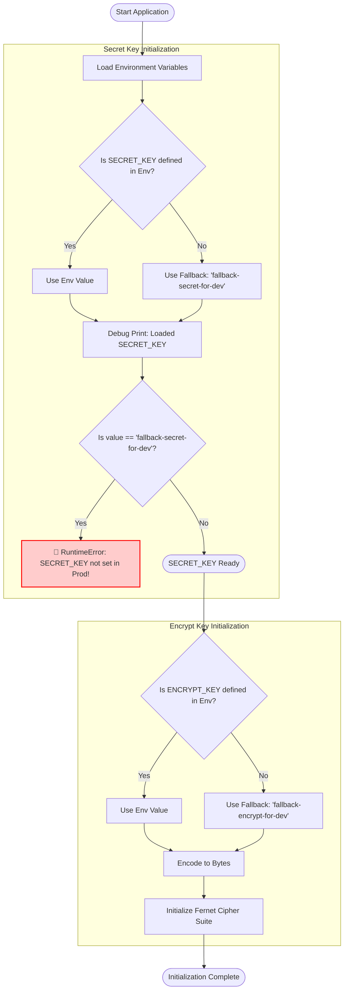

# 🔐 SECRET_KEY Initialization Flow (`new_cmp/main.py`)

This document visualizes the logic for initializing security keys in the application.

## 📝 상세 설명

1.  **환경 변수 로드**: `os.getenv("SECRET_KEY")`를 통해 값을 확인합니다.
2.  **Fallback 로직**: 환경 변수가 없으면 기본값(`fallback-...`)을 사용합니다.
3.  **유효성 검사**: `SECRET_KEY`가 여전히 기본값(`fallback-secret-for-dev`)이라면, 운영 환경(Production)에서의 사고를 방지하기 위해 **RuntimeError를 발생시키고 앱 실행을 중단**합니다.
    *   (코드에는 `if SECRET_KEY == "fallback-secret-for-dev": raise ...` 로직이 포함되어 있습니다)
4.  **암호화 키 설정**: `ENCRYPT_KEY`도 동일하게 로드한 뒤, `Fernet` 객체를 생성하여 DB 비밀번호 암호화/복호화에 사용합니다.
